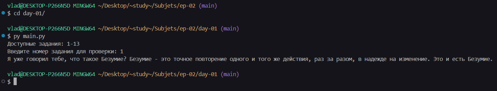
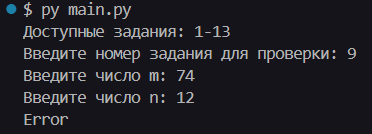

<div style="text-align: center;"> </div

---

# Отчет по учебной практике: День №1

**Учебная практика**: УП.02. Осуществление интеграции профессиональных модулей

**Специальность**: 09.02.07 "Информационные системы и программирование"

**Тема занятия**: Настройка рабочего места, установка программы IDLE, работа с функциями и условной конструкцией.

**Студент**: Бедин Владислав Алексеевич

**Преподаватель**: Cмирнова Юлия Анатольевна

---

## Конспект и ответы на контрольные вопросы


---

## Практические задания

### Задание №1: Конкатенация строк

**Цель**: Составить цитату о безумии из заранее заданных частей с помощью конкатенации строк.

**Код задания**:

```py
def task1():
    '''
    Задание №1: Конкатенация строк.
    '''
    a = 'Безумие'
    b = 'Я уже'
    c = ' '
    d = 'что такое'
    e = 'повторение'
    f = ' и того '
    g = 'раз за разом'
    h = 'на изменение. Это '

    result = (b + c + 'говорил тебе, ' + d + c + a + '? ' + a + ' - это точное ' + e + ' одного' +
              f + 'же действия, ' + g + ', в надежде ' + h + 'и есть ' + a + '.')
    print(result)
```

**Скриншот вывода в консоли**:



### Задание №2: Составление текста

**Цель**: Составить небольшой рассказ из заданного набора слов.

**Код задания**:

```py
def task2():
    '''
    Задание №2: Составление текста.
    '''
    car = 'машина'
    race = 'автогонка'
    vova = 'Вова'
    kira = 'Кира'
    tickets = 'билеты'
    meteor = 'Метеорит'
    ship = 'Космический корабль'
    pirates = 'пираты'

    story = (vova + ' и ' + kira + ' поехали на ' + race + ' на своей старой ' + car + '. Они купили ' + tickets +
             ', но по дороге их ' + car + ' превратилась в ' + ship + '! Оказалось, это проделки ' + pirates +
             ' с планеты ' + meteor + '.')
    print(story)
```

**Скриншот вывода в консоли**:


### Задание №3: Определение типов данных

**Цель**: Определить и вывести типы данных заданных значений.

**Код задания**:

```py
def task3():
    '''
    Задание №3: Определение типов данных.
    '''
    var1 = 'Лара Крофт'
    var2 = '3+5'
    var3 = 782.3
    var4 = False
    var5 = 146

    print(f'Тип переменной var1: {type(var1)}')
    print(f'Тип переменной var2: {type(var2)}')
    print(f'Тип переменной var3: {type(var3)}')
    print(f'Тип переменной var4: {type(var4)}')
    print(f'Тип переменной var5: {type(var5)}')
```

**Скриншот вывода в консоли**:


### Задание №4: Проверка совершеннолетия

**Цель**: Запросить возраст пользователя и проверить, является ли он совершеннолетним.

**Код задания**:

```py
def task4():
    '''
    Задание №4: Проверка совершеннолетия.
    '''
    try:
        age = int(input('Введите ваш возраст: '))
        if age >= 18:
            print('Вы совершеннолетний/совершеннолетняя!')
        else:
            print('Вы несовершеннолетний/несовершеннолетняя!')
    except ValueError:
        print('Ошибка: Введите целое число.')
```

**Скриншот вывода в консоли**:


### Задание №5: Простой калькулятор

**Цель**: Реализовать простой калькулятор с базовыми арифметическими операциями.

**Код задания**:

```py
def task5():
    '''
    Задание №5: Простой калькулятор.
    '''
    try:
        num1 = float(input('Введите первое число: '))
        num2 = float(input('Введите второе число: '))
        operation = input('Выберите операцию (+, -, *, /, //, %, **): ')

        if operation == '+':
            result = num1 + num2
        elif operation == '-':
            result = num1 - num2
        elif operation == '*':
            result = num1 * num2
        elif operation == '/':
            result = num1 / num2
        elif operation == '//':
            result = num1 // num2
        elif operation == '%':
            result = num1 % num2
        elif operation == '**':
            result = num1 ** num2
        else:
            print('Неизвестная операция')
            return

        print(f'Результат: {result}')

    except ValueError:
        print('Ошибка: Введите числа корректно.')
    except ZeroDivisionError:
        print('Ошибка: Деление на ноль.')
```

**Скриншот вывода в консоли**:


### Задание №6: Проверка четности числа

**Цель**: Проверить, является ли введенное пользователем число четным или нечетным.

**Код задания**:

```py
def task6():
    '''
    Задание №6: Проверка четности числа.
    '''
    try:
        number = int(input('Введите число: '))
        if number % 2 == 0:
            print('Четное')
        else:
            print('Нечетное')
    except ValueError:
        print('Ошибка: Введите целое число.')
```

**Скриншот вывода в консоли**:


### Задание №7: Одинаковые цифры в двузначном числе

**Цель**: Проверить, состоит ли двузначное число из одинаковых цифр.

**Код задания**:

```py
def task7():
    '''
    Задание №7: Одинаковые цифры в двузначном числе.
    '''
    try:
        number = int(input('Введите двузначное число: '))
        if 10 <= number <= 99:
            digit1 = number // 10
            digit2 = number % 10
            if digit1 == digit2:
                print('Да')
            else:
                print('Нет')
        else:
            print('Ошибка: Число не является двузначным.')
    except ValueError:
        print('Ошибка: Введите целое число.')
```

**Скриншот вывода в консоли**:


### Задание №8: Количество четных чисел

**Цель**: Посчитать количество четных чисел среди трех введенных пользователем.

**Код задания**:

```py
def task8():
    '''
    Задание №8: Количество четных чисел.
    '''
    try:
        count = 0
        num1 = int(input('Введите первое число: '))
        num2 = int(input('Введите второе число: '))
        num3 = int(input('Введите третье число: '))

        if num1 % 2 == 0:
            count += 1
        if num2 % 2 == 0:
            count += 1
        if num3 % 2 == 0:
            count += 1

        print(f'Количество четных чисел: {count}')

    except ValueError:
        print('Error')
```

**Скриншот вывода в консоли**:


### Задание №9: Целочисленное деление

**Цель**: Выполнить целочисленное деление m на n, если оно возможно.

**Код задания**:

```py
def task9():
    '''
    Задание №9: Целочисленное деление.
    '''
    try:
        m = int(input('Введите число m: '))
        n = int(input('Введите число n: '))
        if m % n == 0:
            print(m // n)
        else:
            print('Error')
    except ZeroDivisionError:
        print('Error: Деление на ноль.')
    except ValueError:
        print('Error: Введите целые числа.')
    except Exception:
        print('Error')
```

**Скриншот вывода в консоли**:



### Задание №10: Сравнение цифр в трехзначном числе

**Цель**: Сравнить вторую и последнюю цифру в трехзначном числе и вывести большую.

**Код задания**:

```py
def task10():
    '''
    Задание №10: Сравнение цифр в трехзначном числе.
    '''
    try:
        number = int(input('Введите трехзначное число: '))
        if 100 <= number <= 999:
            second_digit = (number // 10) % 10
            last_digit = number % 10
            result = max(second_digit, last_digit)
            print(result)
        else:
            print('Ошибка: Число не является трехзначным.')
    except ValueError:
        print('Ошибка: Введите целое число.')
```

**Скриншот вывода в консоли**:


### Задание №11: Определение типа треугольника

**Цель**: Определить, могут ли три числа быть сторонами треугольника, и если да, то его тип.

**Код задания**:

```py
def task11():
    '''
    Задание №11: Определение типа треугольника.
    '''
    try:
        a = float(input('Введите длину первой стороны: '))
        b = float(input('Введите длину второй стороны: '))
        c = float(input('Введите длину третьей стороны: '))

        if a <= 0 or b <= 0 or c <= 0:
            print('Ошибка: Длины сторон должны быть положительными.')
            return

        if (a + b > c) and (a + c > b) and (b + c > a):
            if a == b == c:
                print('Равносторонний треугольник')
            elif a == b or a == c or b == c:
                print('Равнобедренный треугольник')
            else:
                print('Разносторонний треугольник')
        else:
            print('Эти числа не могут быть сторонами треугольника')

    except ValueError:
        print('Ошибка: Введите числа.')
```

**Скриншот вывода в консоли**:


### Задание №12: Китайский гороскоп

**Цель**: Определить животное по китайскому календарю на основе года рождения.

**Код задания**:

```py
def task12():
    '''
    Задание №12: Китайский гороскоп.
    '''
    try:
        birth_year = int(input('Введите год вашего рождения: '))

        animals = [
            'Крыса', 'Бык', 'Тигр', 'Заяц', 'Дракон', 'Змея',
            'Лошадь', 'Овца', 'Обезьяна', 'Петух', 'Собака', 'Свинья'
        ]
        start_year = 1924
        index = (birth_year - start_year) % 12

        print(f'Ваше животное по китайскому календарю: {animals[index]}')

    except ValueError:
        print('Ошибка: Введите год цифрами.')
```

**Скриншот вывода в консоли**:


### Задание №13: Конвертер оценок

**Цель**: Конвертировать числовую оценку (0-100) в буквенную (A-F).

**Код задания**:

```py
def task13():
    '''
    Задание №13: Конвертер оценок.
    '''
    try:
        score = int(input('Введите оценку (0-100): '))

        if not 0 <= score <= 100:
            print('Ошибка: Оценка должна быть от 0 до 100.')
            return

        if score >= 90:
            grade = 'A'
        elif score >= 80:
            grade = 'B'
        elif score >= 70:
            grade = 'C'
        elif score >= 60:
            grade = 'D'
        else:
            grade = 'F'

        print(f'Буквенный эквивалент: {grade}')

    except ValueError:
        print('Ошибка: Введите целое число.')
```

**Скриншот вывода в консоли**:


