<div style="text-align: center;"> </div>

---

# Отчет по учебной практике: День №2

**Учебная практика**: УП.02. Осуществление интеграции профессиональных модулей

**Специальность**: 09.02.07 "Информационные системы и программирование"

**Тема занятия**: Работа с циклами while и for. Изучение новых типов данных.

**Студент**: Бедин Владислав Алексеевич

**Преподаватель**: Смирнова Юлия Анатольевна

---

## Конспект и ответы на контрольные вопросы

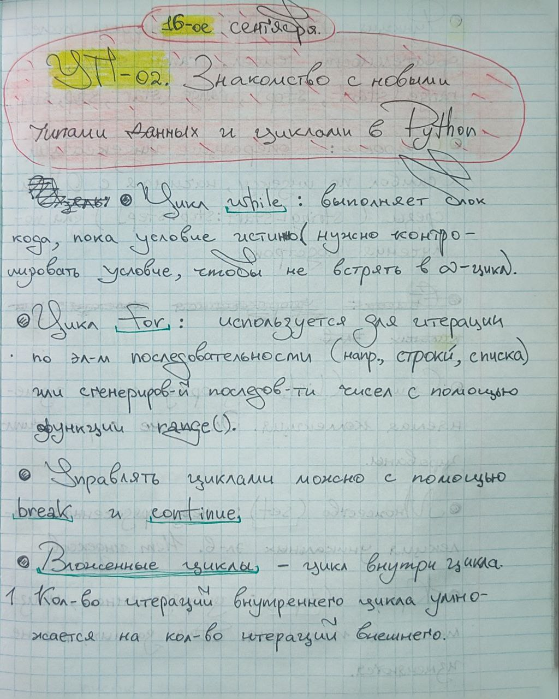
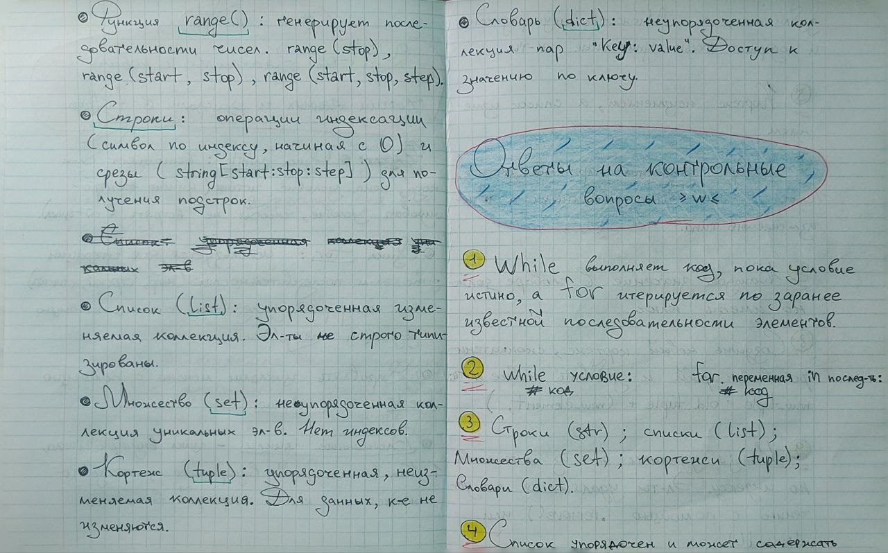
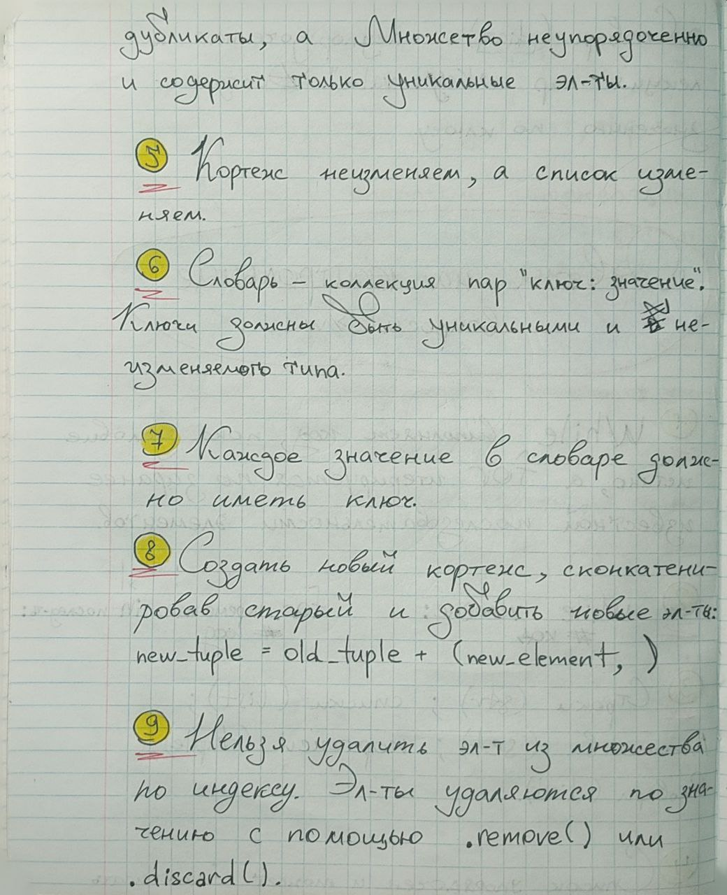
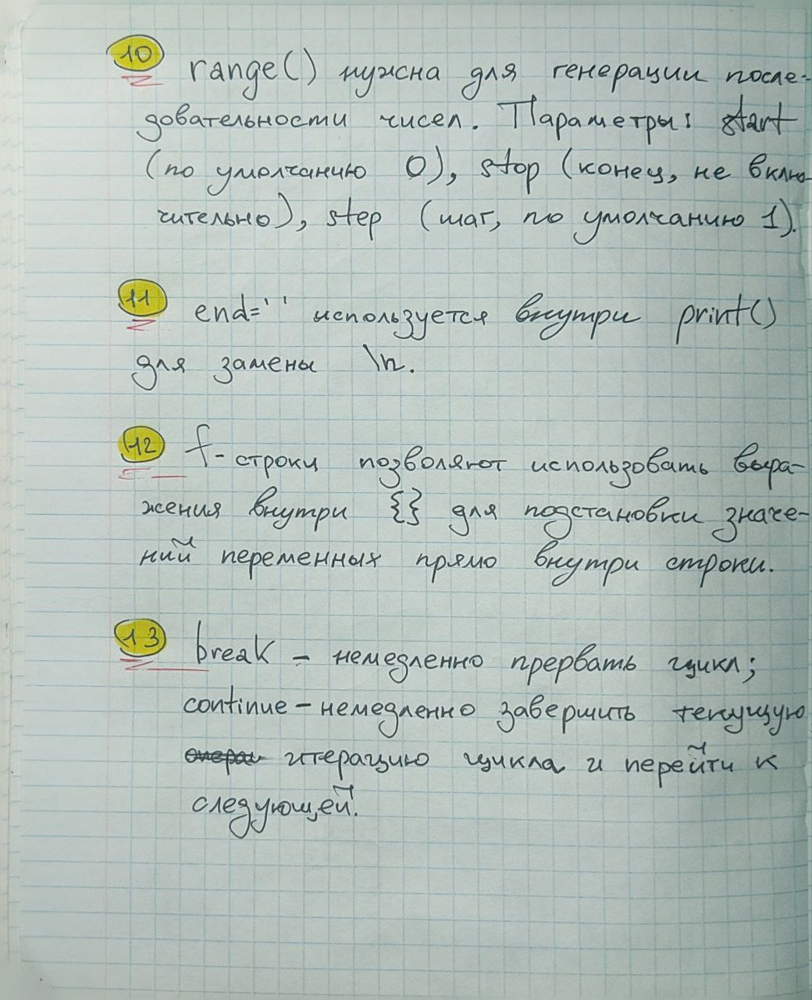

---

## Практические задания

### Задание №1: Обратный отсчет

**Цель**: Вывести на экран обратный отсчет от 20 до 1 и фразу "Поехали!".

**Код задания**:

```py
def task1():
    '''
    Задание №1: Обратный отсчет.
    '''
    for num in range(20, 0, -1):
        print(num)
    print('Поехали!')
```

**Скриншот вывода в консоли**:

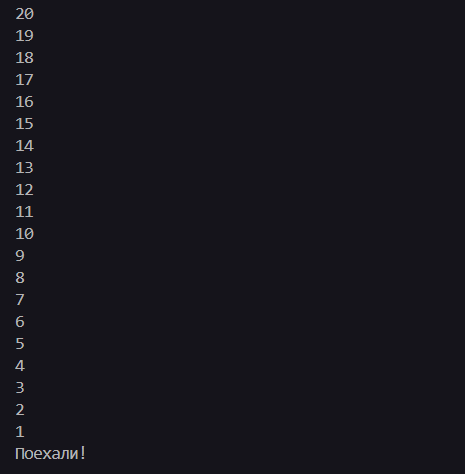

### Задание №2: Лунный вес

**Цель**: Рассчитать и вывести лунный вес для каждого из 15 лет, если земной вес ежегодно увеличивается на 1 кг.

**Код задания**:

```py
def task2():
    '''
    Задание №2: Лунный вес.
    '''
    try:
        earth_weight = float(input('Введите ваш земной вес (кг): '))
        print('Год: Лунный вес')
        for year in range(1, 16):
            current_earth_weight = earth_weight + year
            lunar_weight = current_earth_weight * 0.165
            print(f'{year}: {lunar_weight:.2f} кг')
    except ValueError:
        print('Ошибка: Введите числовое значение для веса.')
```

**Скриншот вывода в консоли**:

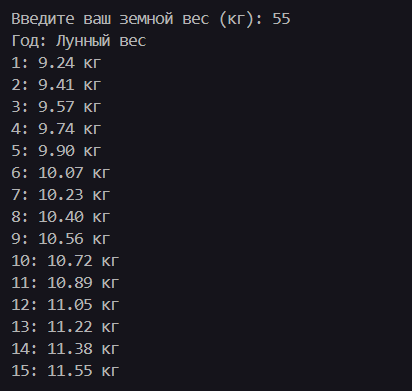

### Задание №3: Заработок монет

**Цель**: Посчитать заработок монет за месяц при известной почасовой ставке и длительности рабочего дня.

**Код задания**:

```py
'''
    Задание №3: Заработок монет.
    '''
    coins_per_hour = 3
    hours_per_shift = 5
    shifts_per_month = 30  # Округлим, что в месяце 30 дней

    total_coins = coins_per_hour * hours_per_shift * shifts_per_month
    print(f'За месяц вы заработаете: {total_coins} монет')
```

**Скриншот вывода в консоли**:

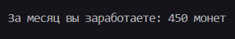

### Задание №4: Клуб по нику

**Цель**: Приветствовать пользователя, если его ник находится в списке друзей.

**Код задания**:

```py
def task4():
    '''
    Задание №4: Клуб по нику.
    '''
    friend_nicks = {'bukabtw', 'nineteentearz',
                    'MindlessMuse666', 'KlemSystem', 'KontsertKishlaka', 'FrierenWay', 'Jenko-zhulenko'}

    user_nick = input('Введите ваш ник: ').strip()

    if user_nick in friend_nicks:
        print(f'Добро пожаловать в клуб, {user_nick}!')
    else:
        print('Доступ запрещен.')
```

**Скриншот вывода в консоли**:

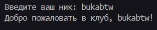

### Задание №5: Високосный год

**Цель**: Определить, является ли введенный пользователем год високосным.

**Код задания**:

```py
def task5():
    '''
    Задание №5: Високосный год.
    '''
    try:
        year = int(input('Введите год для проверки: '))
        '''
        Високосный год:
        1. Делится на 4, но не делится на 100 ИЛИ
        2. Делится на 400
        '''
        if (year % 4 == 0 and year % 100 != 0) or (year % 400 == 0):
            print(f'{year} год - високосный.')
        else:
            print(f'{year} год - невисокосный.')
    except ValueError:
        print('Ошибка: Введите год целым числом.')
```

**Скриншот вывода в консоли**:

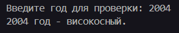

### Задание №6: Максимальное число

**Цель**: Найти наибольшее число из N введенных пользователем чисел.

**Код задания**:

```py
def task6():
    '''
    Задание №6: Максимальное число.
    '''
    try:
        count = int(input('Сколько чисел вы хотите ввести? '))
        if count <= 0:
            print('Ошибка: Количество чисел должно быть положительным.')
            return

        max_number = None
        for i in range(count):
            num = float(input(f'Введите число {i + 1}: '))
            if max_number is None or num > max_number:
                max_number = num

        if max_number is not None:
            print(f'Наибольшее из введенных чисел: {max_number}')
        else:
            print('Числа не были введены.')

    except ValueError:
        print('Ошибка: Введите корректное числовое значение.')
```

**Скриншот вывода в консоли**:

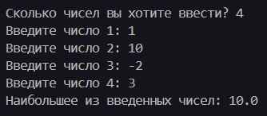

### Задание №7: Факториал

**Цель**: Вычислить факториал введенного числа.

**Код задания**:

```py
def task7():
    '''
    Задание №7: Факториал.
    '''
    try:
        n = int(input('Введите неотрицательное целое число: '))
        if n < 0:
            print('Ошибка: Факториал определен только для неотрицательных целых чисел.')
            return

        factorial = 1
        # Вычисляем факториал от 1 до n
        for i in range(1, n + 1):
            factorial *= i

        print(f'Факториал числа {n} равен {factorial}')

    except ValueError:
        print('Ошибка: Пожалуйста, введите целое число.')
```

**Скриншот вывода в консоли**:

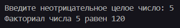

### Задание №8: Таблица умножения

**Цель**: Вывести таблицу умножения от 1 до 10.

**Код задания**:

```py
def task8():
    '''
    Задание №8: Таблица умножения.
    '''
    for i in range(1, 11):
        for j in range(1, 11):
            print(f'{i} * {j} = {i * j}')
        print('-' * 12)
```

**Скриншот вывода в консоли**:

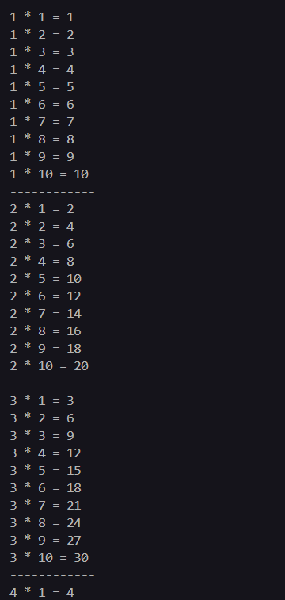

### Задание №9: Сумма с уменьшением

**Цель**: Запросить положительное число. Суммировать его с числами на единицу меньше на каждой итерации, пока исходное число не уменьшится до 0.

**Код задания**:

```py
def task9():
    '''
    Задание №9: Сумма с уменьшением.
    '''
    try:
        user_num = int(input('Введите положительное число: '))
        if user_num <= 0:
            print('Счётчик = 0')
            return

        total = 0
        current = user_num
        while current > 0:
            total += current
            current -= 1

        print(f'Результат: {total}')

    except ValueError:
        print('Ошибка: Введите целое число.')
```

**Скриншот вывода в консоли**:

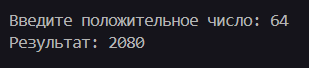
