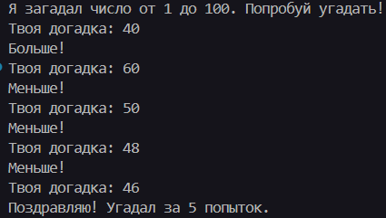

<div style="text-align: center;"> </div>

---

# Отчет по учебной практике: День №3

**Учебная практика**: УП.02. Осуществление интеграции профессиональных модулей

**Специальность**: 09.02.07 "Информационные системы и программирование"

**Тема занятия**: Отработка теории на практических кейсах

**Студент**: Бедин Владислав Алексеевич

**Преподаватель**: Смирнова Юлия Анатольевна

---

## Практические задания

### [Задание №1](../day-03/src/hero.py): Создание игрового персонажа

**Цель**: Реализовать программу для создания персонажа с выбором расы и повышением характеристик по уровням.

**Код задания**:

```py
def create_hero():
    '''
    Создание персонажа с выбором расы и повышением характеристик по уровням.
    '''
    print('Добро пожаловать в мир магии и приключений!')
    name = input('Как зовут твоего героя? ')
    races = ['эльф', 'гном', 'человек', 'хоббит']
    
    print(f'Я рад видеть тебя, {name}! К какому виду ты принадлежишь: {races}?')
    
    hp = 0
    damage = 0
    chosen_race = input('Твой выбор: ').lower()
    
    if chosen_race == 'эльф':
        hp, damage = 80, 15
    elif chosen_race == 'гном':
        hp, damage = 100, 12
    elif chosen_race == 'человек':
        hp, damage = 90, 14
    elif chosen_race == 'хоббит':
        hp, damage = 70, 10
    else:
        print('Неизвестная раса! Установлены стандартные характеристики.')
        hp, damage = 50, 5
    
    print(f'\nТвой герой: {name}')
    print(f'Раса: {chosen_race}')
    print(f'Здоровье: {hp}')
    print(f'Урон: {damage}')
    
    levels = [1, 2, 3, 4, 5]
    for level in levels:
        hp += 10
        damage += 2
        print(f'Уровень {level}: HP={hp}, Урон={damage}')

if __name__ == '__main__':
    create_hero()
```

**Скриншот вывода в консоли**:


### [Задание №2](../day-03/src/palindrome.py): Проверка палиндрома

**Цель**: Написать программу для проверки, является ли объединенная строка палиндромом.

**Код задания**:

```py
def check_palindrome():
    '''
    Проверка, является ли объединенная строка палиндромом.
    '''
    str1 = input('Введите первую строку: ')
    str2 = input('Введите вторую строку: ')
    combined = str1 + str2
    is_palindrome = combined == combined[::-1]
    print('Строка является палиндромом' if is_palindrome else 'Строка не является палиндромом')

if __name__ == '__main__':
    check_palindrome()
```

**Скриншот вывода в консоли**:


### [Задание №3](../day-03/src/guess_num.py): Игра "Угадай число"

**Цель**: Реализовать игру, где компьютер загадывает число, а игрок должен угадать его.

**Код задания**:

```py
import random

def guess_number():
    '''
    Игра "Угадай число" от 1 до 100 с подсчетом попыток.
    '''
    target = random.randint(1, 100)
    attempts = 0
    print('Я загадал число от 1 до 100. Попробуй угадать!')
    
    while True:
        guess = int(input('Твоя догадка: '))
        attempts += 1
        if guess < target:
            print('Больше!')
        elif guess > target:
            print('Меньше!')
        else:
            print(f'Поздравляю! Угадал за {attempts} попыток.')
            break

if __name__ == '__main__':
    guess_number()
```

**Скриншот вывода в консоли**:



### [Задание №4](../day-03/src/tic_tac_toe.py): Игра "Крестики-нолики"

**Цель**: Реализовать классическую игру в крестики-нолики для двух игроков.

**Код задания**:

```py
def tic_tac_toe():
    '''
    Игра в крестики-нолики для двух игроков.
    '''
    board = [[' ' for _ in range(3)] for _ in range(3)]
    current_player = 'X'
    
    def print_board():
        for row in board:
            print('|'.join(row))
            print('-' * 5)
    
    def check_win():
        for i in range(3):
            if board[i][0] == board[i][1] == board[i][2] != ' ':
                return True
            if board[0][i] == board[1][i] == board[2][i] != ' ':
                return True
        if board[0][0] == board[1][1] == board[2][2] != ' ':
            return True
        if board[0][2] == board[1][1] == board[2][0] != ' ':
            return True
        return False
    
    moves_count = 0
    while moves_count < 9:
        print_board()
        row = int(input(f'Игрок {current_player}, выбери строку (0-2): '))
        col = int(input(f'Игрок {current_player}, выбери столбец (0-2): '))
        
        if board[row][col] == ' ':
            board[row][col] = current_player
            moves_count += 1
            if check_win():
                print_board()
                print(f'Игрок {current_player} победил!')
                return
            current_player = 'O' if current_player == 'X' else 'X'
        else:
            print('Ячейка уже занята!')
    
    print_board()
    print('Ничья!')
    

if __name__ == '__main__':
    tic_tac_toe()
```

**Скриншот вывода в консоли**:


