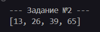
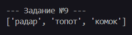

<div style="text-align: center;"> </div>

---

# Отчет по учебной практике: День №4

**Учебная практика**: УП.02. Осуществление интеграции профессиональных модулей

**Специальность**: 09.02.07 "Информационные системы и программирование"

**Тема занятия**: Работа с функциями высшего порядка и обработка последовательностей.

**Студент**: Бедин Владислав Алексеевич

**Преподаватель**: Смирнова Юлия Анатольевна

---

## Конспект и ответы на контрольные вопросы


---

## Практические задания

### Задание №1: Подсчет среднего значения

**Цель**: Реализовать функцию, которая принимает переменное количество аргументов и вычисляет их среднее значение, игнорируя нечисловые аргументы.

**Код задания**:

```py
def calculate_average(*args) -> float:
    '''
    Задание №1: Среднее значение из переменного количества аргументов.
    '''
    numbers = [arg for arg in args if isinstance(arg, (int, float))]
    if not numbers:
        return 0
    return sum(numbers) / len(numbers)
```

**Пример использования**:

```py
print(calculate_average(1, 2, 3, 4, 5))            # 3.0
print(calculate_average(1.5, 2.5, 'a', 3.5, 4.5))  # 3.0
print(calculate_average(10, 20, 30, 40))           # 25.0
```

**Скриншот вывода в консоли**:


### Задание №2: Обратная строка

**Цель**: Реализовать функцию, которая принимает строку и возвращает новую строку с обратным порядком слов, где каждое слово записано задом наперёд.

**Код задания**:

```py
def reverse_words(sentence: str) -> str:
    '''
    Задание №2: Принимает строку и возвращает новую строку с обратным порядком слов.
    '''
    words = sentence.split()
    reversed_words = [word[::-1] for word in words]
    return ' '.join(reversed_words)
```

**Пример использования**:

```py
print(reverse_words('Hello world'))        # olleH dlrow
print(reverse_words('Python is awesome'))  # nohtyP si emosewa
print(reverse_words('Привет мир'))         # тевирП рим
```

**Скриншот вывода в консоли**:


### Задание №3: Палиндром ли?

**Цель**: Реализовать функцию, которая проверяет, является ли строка палиндромом, игнорируя пробелы, знаки препинания и регистр.

**Код задания**:

```py
import re

def is_palindrome(text: str) -> bool:
    '''
    Задание №3: Проверяет, является ли строка палиндромом.
    '''
    cleaned_text = re.sub(r'[^\w]', '', text.lower())
    return cleaned_text == cleaned_text[::-1]
```

**Пример использования**:

```py
print(is_palindrome('A man, a plan, a canal: Panama'))  # True
print(is_palindrome('racecar'))  # True
print(is_palindrome('hello'))    # False
print(is_palindrome('А роза упала на лапу Азора'))  # True
```

**Скриншот вывода в консоли**:


### Задание №4: Наибольшая общая подпоследовательность двух строк

**Цель**: Реализовать функцию, которая находит наибольшую общую подпоследовательность двух строк.

**Код задания**:

```py
def find_longest_subsequence(str1: str, str2: str) -> str:
    '''
    Задание №4: Находит наибольшую общую подпоследовательность двух строк.
    '''
    m, n = len(str1), len(str2)
    dp = [[0] * (n + 1) for _ in range(m + 1)]

    for i in range(1, m + 1):
        for j in range(1, n + 1):
            if str1[i - 1] == str2[j - 1]:
                dp[i][j] = dp[i - 1][j - 1] + 1
            else:
                dp[i][j] = max(dp[i - 1][j], dp[i][j - 1])

    # Восстановление подпоследовательности
    i, j = m, n
    result = []
    while i > 0 and j > 0:
        if str1[i - 1] == str2[j - 1]:
            result.append(str1[i - 1])
            i -= 1
            j -= 1
        elif dp[i - 1][j] > dp[i][j - 1]:
            i -= 1
        else:
            j -= 1

    return ''.join(reversed(result))
```

**Пример использования**:

```py
print(find_longest_subsequence('ABCDGH', 'AEDFHR'))   # ADH
print(find_longest_subsequence('AGGTAB', 'GXTXAYB'))  # GTAB
print(find_longest_subsequence('abcde', 'ace'))       # ace
```

**Скриншот вывода в консоли**:


### Задание №1: Степени числа 2

**Цель**: Вывести степени числа 2 с использованием lambda и map.

**Код задания**:

```py
def task1():
    '''
    Задание №1: Вывод степеней числа 2.
    '''
    n = 10
    powers = list(map(lambda x: 2 ** x, range(1, n + 1)))
    print(powers)
```

**Скриншот вывода в консоли**:


### Задание №2: Числа, кратные 13

**Цель**: Найти числа, кратные 13, в списке.

**Код задания**:

```py
def task2():
    '''
    Задание №2: Поиск чисел, кратных 13, в списке.
    '''
    numbers = [13, 26, 5, 39, 50, 65]
    multiples = list(filter(lambda x: x % 13 == 0, numbers))
    print(multiples)
```

**Скриншот вывода в консоли**:



### Задание №3: Улучшенный калькулятор

**Цель**: Реализовать калькулятор с функциями и обработкой ошибок.

**Код задания**:

```py
def task3():
    '''
    Задание №3: Калькулятор с функциями.
    '''
    def add(a, b):
        return a + b

    def subtract(a, b):
        return a - b

    def multiply(a, b):
        return a * b

    def divide(a, b):
        try:
            return a / b
        except ZeroDivisionError:
            print('Ошибка: Деление на ноль.')

    operations = {
        '+': add,
        '-': subtract,
        '*': multiply,
        '/': divide
    }

    try:
        a = float(input('Введите первое число: '))
        op = input('Введите операцию (+, -, *, /): ')
        b = float(input('Введите второе число: '))
        result = operations.get(op, lambda x, y: 'Неизвестная операция')(a, b)
        print(f'Результат: {result}')
    except ValueError:
        print('Ошибка: введите числа.')
```

**Скриншот вывода в консоли**:


### Задание №4: Календарь на месяц и год

**Цель**: Вывести календарь на указанный месяц и год.

**Код задания**:

```py
import calendar

def task4():
    '''
    Задание №4: Вывод календаря.
    '''
    year = int(input('Введите год: '))
    month = input('Введите месяц (например, январь): ').lower()
    months = {
        'январь': 1,
        'февраль': 2,
        'март': 3,
        'апрель': 4,
        'май': 5,
        'июнь': 6,
        'июль': 7,
        'август': 8,
        'сентябрь': 9,
        'октябрь': 10,
        'ноябрь': 11,
        'декабрь': 12
    }
    if month not in months:
        print('Неверный месяц.')
        return
    print(calendar.month(year, months[month]))
```

**Скриншот вывода в консоли**:


### Задание №5: Таблица умножения

**Цель**: Вывести таблицу умножения для чисел 4, 7, 9.

**Код задания**:

```py
def task5():
    '''
    Задание №5: Таблица умножения для чисел 4, 7, 9.
    '''
    for num in [4, 7, 9]:
        print(f'Таблица умножения для {num}:')
        for i in range(1, 11):
            print(f'{num} * {i} = {num * i}')
        print()
```

**Скриншот вывода в консоли**:


### Задание №6: Площадь окружности

**Цель**: Вычислить площадь окружности.

**Код задания**:

```py
def task6():
    '''
    Задание №6: Вычисление площади окружности.
    '''
    def calculate_area(radius, pi=3.14):
        return pi * (radius ** 2)

    print(calculate_area(5))
    print(calculate_area(3, 3.14159))
```

**Скриншот вывода в консоли**:


### Задание №7: Среднее арифметическое

**Цель**: Вычислить среднее арифметическое списка чисел.

**Код задания**:

```py
def task7():
    '''
    Задание №7: Среднее арифметическое списка чисел.
    '''
    def calculate_average(numbers):
        return sum(numbers) / len(numbers)

    print(calculate_average([1, 2, 3, 4, 5]))
    print(calculate_average([10, 20, 30]))
```

**Скриншот вывода в консоли**:


### Задание №8: Проверка на простое число

**Цель**: Проверить, является ли число простым.

**Код задания**:

```py
def task8():
    '''
    Задание №8: Валидация: число простое.
    '''
    def is_prime(n):
        if n < 2:
            return False
        for i in range(2, int(n ** 0.5) + 1):
            if n % i == 0:
                return False
        return True

    print(is_prime(7))
    print(is_prime(10))
```

**Скриншот вывода в консоли**:


### Задание №9: Поиск палиндромов

**Цель**: Найти палиндромы в списке слов.

**Код задания**:

```py
def task9():
    '''
    Задание №9: Поиск палиндромов в списке.
    '''
    def find_palindromes(words):
        return [word for word in words if word == word[::-1]]

    words = ['радар', 'мир', 'топот', 'комок', 'python']
    print(find_palindromes(words))
```

**Скриншот вывода в консоли**:


