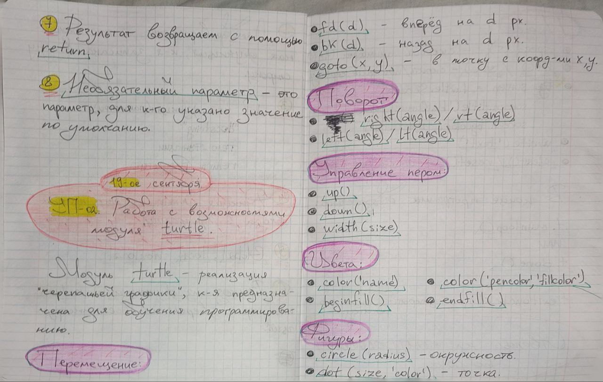
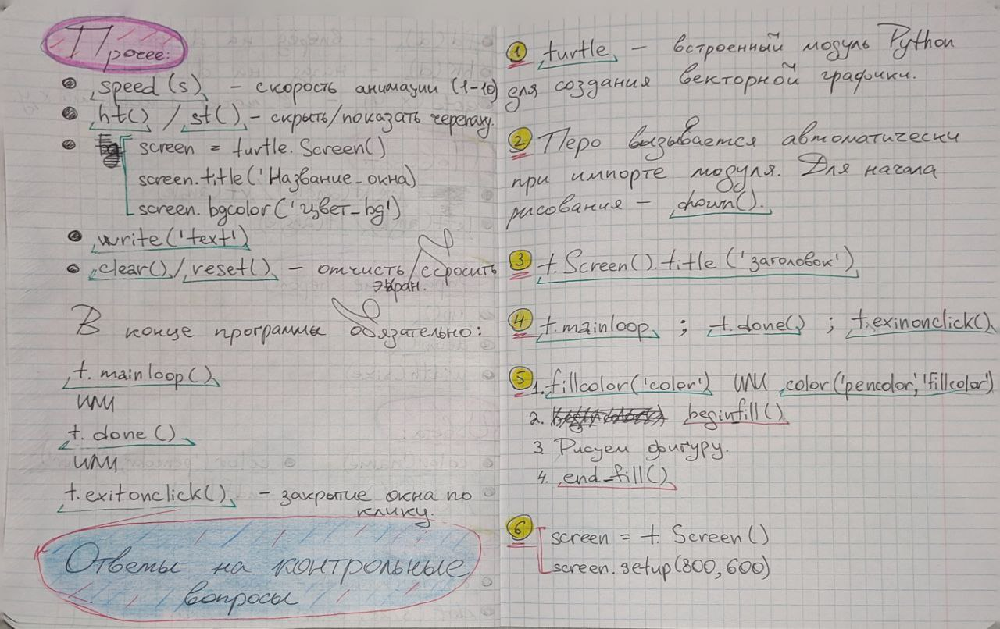
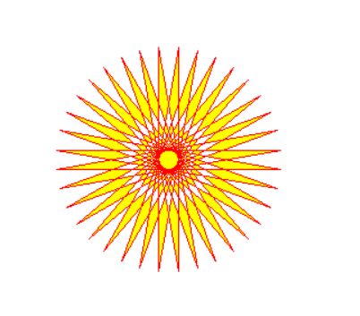
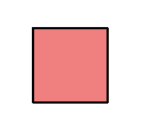
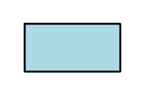
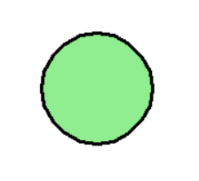
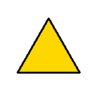
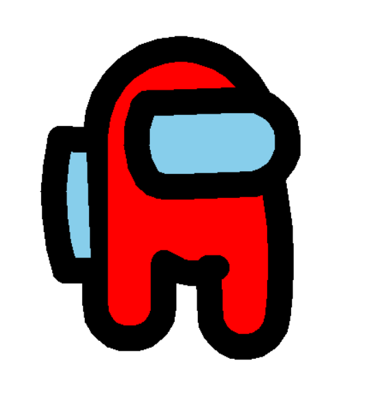
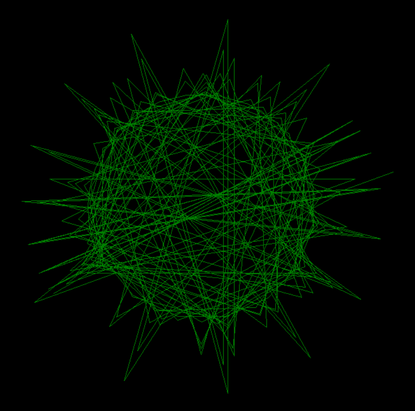

<div style="text-align: center;"> </div>

---

# Отчет по учебной практике: День №5

**Учебная практика**: УП.02. Осуществление интеграции профессиональных модулей

**Специальность**: 09.02.07 "Информационные системы и программирование"

**Тема занятия**: Работа с возможностями модуля `turtle`.

**Студент**: Бедин Владислав Алексеевич

**Преподаватель**: Смирнова Юлия Анатольевна

---

## Конспект и ответы на контрольные вопросы




---

## Практические задания

### [Задание №1](./src/turtle_sun.py): Солнцеподобная фигура

**Цель**: Отрисовать с помощью `turtle` фигуру, которая похожа на Солнце.

**Код задания**:

```py
import turtle

PEN_COLOR = 'red'
FILL_COLOR = 'yellow'


def sun(t: turtle.Turtle):
    t.color(PEN_COLOR, FILL_COLOR)
    t.begin_fill()

    while True:
        t.forward(200)
        t.left(170)

        if abs(t.pos()) < 1:
            break

    t.end_fill()


def main():
    '''
    Главная функция, которая отрисовывает солнце.
    '''
    t = turtle.Turtle()
    t.shape('turtle')

    sun(t)

    t.ht()
    turtle.done()


if __name__ == '__main__':
    main()
```

**Скриншот вывода**:



### [Задание №2](./src/turtle_shapes.py): Фигуры

**Цель**: Отрисовать с помощью `turtle` фигуры: Квадрат, Прямоугольник, Круг, Треугольник.

**Код задания**:

```py
import turtle
import os


def clear_screen():
    '''
    Очищает консоль.
    '''
    os.system('cls' if os.name == 'nt' else 'clear')


def setup_turtle() -> turtle.Turtle:
    '''
    Настраивает конфиг черепашки.
    '''
    t = turtle.Turtle()
    t.shape('turtle')
    t.speed(5)
    t.width(3)
    
    return t


def clear_canvas(t: turtle.Turtle):
    '''
    Очищает холст и возвращает черепашку в начальное положение.
    '''
    t.clear()
    t.penup()
    t.goto(0, 0)
    t.pendown()
    t.setheading(0)  # Сброс направления
    t.st()


def draw_square(t: turtle.Turtle, size=100, fill_color='red'):
    '''
    Рисует квадрат.
    '''
    t.color('black', fill_color)
    t.begin_fill()
    for _ in range(4):
        t.forward(size)
        t.left(90)
    t.end_fill()
    t.ht()


def draw_rectangle(t: turtle.Turtle, width=150, height=75, fill_color='blue'):
    '''
    Рисует прямоугольник.
    '''
    t.color('black', fill_color)
    t.begin_fill()
    
    for _ in range(2):
        t.forward(width)
        t.left(90)
        t.forward(height)
        t.left(90)
        
    t.end_fill()
    t.ht()


def draw_circle(t: turtle.Turtle, radius=50, fill_color='green'):
    '''
    Рисует круг.
    '''
    t.color('black', fill_color)
    t.begin_fill()
    t.circle(radius)
    t.end_fill()
    t.ht()


def draw_triangle(t: turtle.Turtle, size=100, fill_color='orange'):
    '''
    Рисует равносторонний треугольник.
    '''
    t.color('black', fill_color)
    t.begin_fill()
    
    for _ in range(3):
        t.forward(size)
        t.left(120)
        
    t.end_fill()
    t.ht()


def show_menu():
    '''
    Отображает меню выбора фигур.
    '''
    print('\n🎨 ВЫБЕРИТЕ ФИГУРУ ДЛЯ ОТРИСОВКИ 🎨\n')
    print('1 - Квадрат')
    print('2 - Прямоугольник')
    print('3 - Круг')
    print('4 - Треугольник')
    print('q - Выйти из программы\n')


def main():
    '''
    Главная функция, которая отрисовывает фигуру по выбору
    '''
    # Настройка экрана
    screen = turtle.Screen()
    screen.title('Рисование фигур с Turtle')
    screen.bgcolor('white')

    # Конфиг черепашки
    t = setup_turtle()

    while True:
        clear_screen()
        show_menu()

        choice = input('Ваш выбор: ').strip().lower()

        if choice == 'q':
            print('До свидания! 👋')
            break

        clear_canvas(t)

        if choice == '1':
            print('Рисую квадрат...')
            draw_square(t, fill_color='lightcoral')
        elif choice == '2':
            print('Рисую прямоугольник...')
            draw_rectangle(t, fill_color='lightblue')
        elif choice == '3':
            print('Рисую круг...')
            draw_circle(t, fill_color='lightgreen')
        elif choice == '4':
            print('Рисую треугольник...')
            draw_triangle(t, fill_color='gold')
        else:
            print('❌ Неверный выбор! Попробуйте снова.')
            input('Нажмите Enter для продолжения...')
            continue

        print('Фигура нарисована! ✅')
        input('Нажмите Enter для возврата в меню...')

    screen.bye()


if __name__ == '__main__':
    main()
```

**Скриншот вывода**:

<div style="display: flex; justify-content: space-between; align-items: center; gap: 20px;">
    
    
    
    
</div>

### [Задание №3](./src/turtle_amongus.py): Амогус

**Цель**: Отрисовать с помощью `turtle` Амогуса.

**Код задания**:

```py
import turtle

BODY_COLOR = 'red'
GLASS_COLOR = 'skyblue'


def body(t: turtle.Turtle):
    '''
    Отрисовывает тело амогуса.
    '''
    t.pensize(30)

    t.fillcolor(BODY_COLOR)
    t.begin_fill()

    # Сторона справа
    t.right(90)
    t.forward(50)
    t.right(180)
    t.circle(40, -180)
    t.right(180)
    t.forward(200)

    # Голова
    t.right(180)
    t.circle(100, -180)

    # Сторона слева
    t.backward(20)
    t.left(15)
    t.circle(500, -20)
    t.backward(20)

    t.circle(40, -180)
    t.left(7)
    t.backward(50)

    t.up()
    t.left(90)
    t.forward(10)
    t.right(90)
    t.down()

    t.right(240)
    t.circle(50, -70)

    t.end_fill()


def glass(t: turtle.Turtle):
    '''
    Отрисовывает очки амогуса.
    '''
    t.up()
    t.right(230)
    t.forward(100)
    t.left(90)
    t.forward(20)
    t.right(90)
    t.down()

    t.fillcolor(GLASS_COLOR)
    t.begin_fill()

    t.right(150)
    t.circle(90, -55)

    t.right(180)
    t.forward(1)
    t.right(180)
    t.circle(10, -65)
    t.right(180)
    t.forward(110)
    t.right(180)

    t.circle(50, -190)
    t.right(170)
    t.forward(80)

    t.right(180)
    t.circle(45, -30)

    t.end_fill()


def backpack(t: turtle.Turtle):
    '''
    Отрисовывает рюкзак амогуса.
    '''
    t.up()
    t.right(60)
    t.forward(100)
    t.right(90)
    t.forward(75)

    t.fillcolor(GLASS_COLOR)
    t.begin_fill()

    t.down()
    t.forward(30)
    t.right(255)

    t.circle(300, -30)
    t.right(260)
    t.forward(30)
    t.end_fill()


def main():
    '''
    Главная функция, которая отрисовывает амогуса.
    '''
    t = turtle.Turtle()
    t.shape('turtle')

    body(t)
    glass(t)
    backpack(t)

    t.ht()
    turtle.done()


if __name__ == '__main__':
    main()
```

**Скриншот вывода в консоли**:



### [Задание №4](./src/turtle_virus.py): Вирус

**Цель**: Отрисовать с помощью `turtle` Вирус.

**Код задания**:

```py
import turtle

PEN_COLOR = 'green'
BG_COLOR = 'black'


def virus(t: turtle.Turtle):
    '''
    Метод отрисовки вируса.
    '''
    t.speed(40)
    t.color(PEN_COLOR)
    b = 200

    while b > 0:
        t.left(b)
        t.forward(b*3)
        b = b - 1


def main():
    '''
    Главная функция, которая отрисовывает вирус.
    '''
    turtle.bgcolor(BG_COLOR)
    t = turtle.Turtle()
    t.shape('turtle')

    virus(t)

    t.ht()
    turtle.done()


if __name__ == '__main__':
    main()
```

**Скриншот вывода в консоли**:


